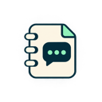

# Gemini Notebook Companion



**A notebook companion. Less switching.**

Keep NotebookLM / Gemini Notebook beside what you're reading, watching, or studying. Available for desktop Chrome and Firefox.

## Why I built this

Studying often means a PDF in one tab, a lecture in another, and NotebookLM somewhere behind them. I built Notebook Companion to keep the conversation beside the material, without repeatedly switching back to the full notebook dashboard.

## Features

- **Sidebar:** keep your notebook beside the current tab.
- **Floating window:** a movable, resizable pop-out that reuses the same window.
- **Floating button:** add a draggable launcher to the page you're reading.
- **Chat only:** compact styling with fewer notebook panels, plus a toggle in the pop-out.
- **Remembered notebook:** save your link and Google account selection locally.
- **Account switching:** return supported account-selector tabs to the existing pop-out.
- **Keyboard shortcuts:** toggle the sidebar or pop-out without opening the menu.
- **Light, dark, or system theme:** for Notebook Companion's controls.

No API key, backend, analytics, or runtime dependencies. An independent project, not affiliated with Google.

## Install

### Chrome 142+

1. Download or clone this repository.
2. Open `chrome://extensions` and enable **Developer mode**.
3. Choose **Load unpacked** and select the project folder.
4. Pin **Gemini Notebook Companion**.

### Firefox 140+

Build the Firefox package with Node.js 20+:

```sh
npm run build
```

Open `about:debugging#/runtime/this-firefox`, choose **Load Temporary Add-on**, and select `dist/firefox/manifest.json`. Temporary installations last until Firefox restarts.

## Use

Sign in to Notebook in a regular tab. Open Notebook Companion and choose **Use current tab**, or paste a notebook link and save it. Choose **Sidebar** or **Floating window**.

Choose **Floating button on this page** to add a launcher. Drag it to move; use × to remove it. It lasts until the page reloads. Browser pages and built-in PDF viewers don't allow the button; use the sidebar or pop-out there.

| Action | macOS | Windows / Linux |
| --- | --- | --- |
| Toggle sidebar | Control + Shift + Y | Alt + C |
| Toggle floating window | Control + Shift + U | Alt + Shift + C |

The popup shows your actual assigned shortcuts. Change them in your browser's extension shortcut settings if a combination is unavailable.

## A few limits

Firefox loads Notebook directly in its native sidebar. Chrome's iframe mode is experimental and opt-in; it removes frame/CSP response headers only for companion frames. Use the floating window if embedding is blocked. [Details and permissions](docs/technical-notes.md).

The floating window is not always-on-top. Google controls sign-in and chat history; unsent drafts aren't backed up. Compact styling can need updates when Google's layout changes. Notebook Companion stores settings and notebook links on your device; Notebook itself still connects to Google.

## Development

```sh
npm test
npm run build
```

The build produces `dist/chrome` and `dist/firefox`. After an update, reload the extension and reopen its windows. The Firefox extension ID stays unchanged so existing development installations retain their settings.

[Changelog](CHANGELOG.md) · [Technical notes](docs/technical-notes.md) · [Icon generation](docs/icon-prompt.md)

## License

[MIT](LICENSE).
